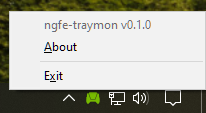

ngfe-traymon
============

A small program that sits in the taskbar and shows a notification when a client connects to or
disconnects from a locally-running [GameStream][] service hosted by the [GeForce Experience][]
application.

This project is not endorsed by or affiliated with Nvidia in any way.

Usage
-----
1. Compile the build with `cargo build --release` or download a pre-compiled version from [here][releases]
2. Copy `ngfe-traymon.exe` into your [startup folder][] so it automatically runs on login.

Screenshots
-----------
| Description          | Screenshot                                      |
| -------------------- | ----------------------------------------------- |
| No clients connected |          |
| Client connected     |  |
| Showing menu         |   |
| Client disconnected  |      |

Licence
-------
Licensed under the [GNU GPLv3][]

 [GameStream]: https://www.nvidia.com/en-us/shield/support/shield-tv/gamestream/
 [GeForce Experience]: https://www.nvidia.com/en-us/geforce/geforce-experience/
 [GNU GPLv3]: https://www.gnu.org/licenses/gpl-3.0.en.html
 [releases]: https://github.com/pR0Ps/ngfe-traymon/releases/
 [startup folder]: https://support.microsoft.com/en-us/windows/add-an-app-to-run-automatically-at-startup-in-windows-10-150da165-dcd9-7230-517b-cf3c295d89dd